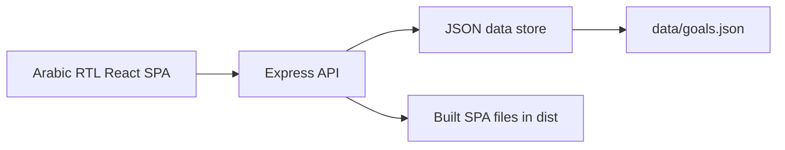

# Portfolio Case Study: Team Goals Tracker

## Overview

Team Goals Tracker is an Arabic-first internal web app for small teams. It helps managers assign goals, lets employees record progress and activities, and gives Super Admins the tools needed to manage users, backups, and app initialization.

The goal was to build something simple, approachable, and practical: a tool that a team can understand quickly without training or a heavy project management process.

## Problem

Small teams often track goals through scattered spreadsheets, chat messages, or manual updates. This makes it hard to answer basic questions:

- Who owns each goal?
- What was done recently?
- Which goals are late or at risk?
- How much progress has been made?
- Who changed important data?

The app centralizes these workflows while keeping the interface lightweight.

## Users

### Super Admin

Owns system setup and safety:

- Manage users and roles
- Activate or deactivate accounts
- Download backups
- Restore data
- Initialize the app for fresh use
- Review audit log

### Manager

Owns team goals:

- Create goals
- Assign goals to employees
- Update goal details
- Review team progress
- Export reports
- Receive notifications for activities and at-risk goals

### Employee

Owns progress updates:

- View assigned goals
- Update completion percentage
- Change goal status
- Add activity notes
- Use role-specific guide
- Read in-app notifications

## Key Features

- Arabic RTL SPA
- Role-based dashboard
- Goal creation and assignment
- Completion percentage tracking
- Activity timeline per goal
- Team reports and CSV export
- In-app notifications
- Role-specific user guide modal
- Super Admin user management
- Backup, restore, and reset
- Audit log
- Docker deployment

## Technical Decisions

### React SPA

The UI is implemented as a single-page app so the experience feels fast and simple. Role-based rendering keeps each user focused on the actions they need.

### Express API

Express provides a small, readable backend with clear role checks and simple API routes.

### JSON Persistence

The first version uses JSON storage to keep deployment simple on a VPS. For a small team, this reduces operational complexity. The storage layer is isolated enough to migrate later to SQLite or PostgreSQL.

### In-App Notifications

Notifications are intentionally in-app only. This avoids email or push setup while still keeping users aware of important events.

### Docker-Ready Deployment

The production server serves both the SPA and API from one container and one port. Docker Compose mounts the data folder for persistence.

## Architecture



## What I Would Improve Next

- Add automated end-to-end tests with Playwright.
- Add optional SQLite persistence for larger teams.
- Add per-goal comments or attachments.
- Add notification filtering.
- Add password/PIN reset flow.
- Add charts for completion trends over time.

## Deployment Story

The app can be deployed with:

```bash
docker compose up -d --build
```

The container exposes port `4174` and stores app data in a persistent `data/` folder on the server.

## Project Value

This project demonstrates:

- Product thinking for role-based internal tools
- Full-stack TypeScript development
- Arabic RTL interface design
- Authentication and authorization basics
- Data backup and restore workflows
- Dockerized deployment for VPS environments
- Practical documentation for developers and stakeholders
